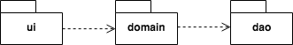
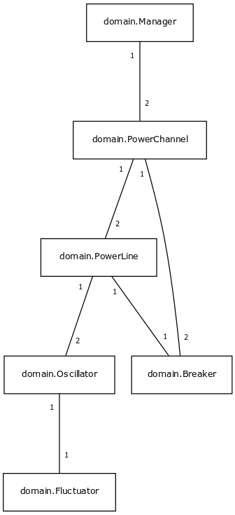
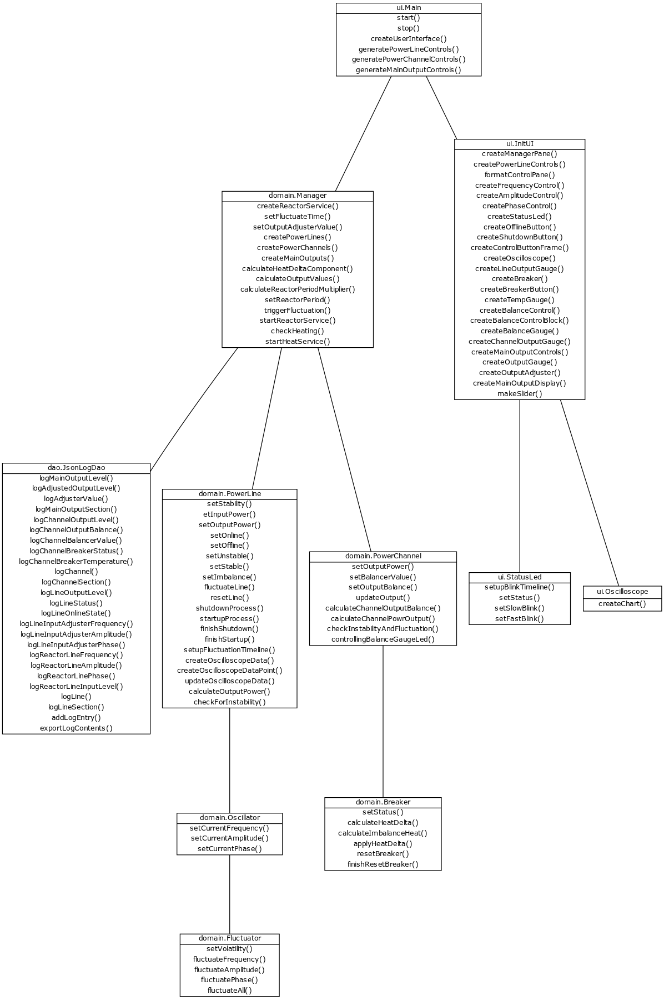
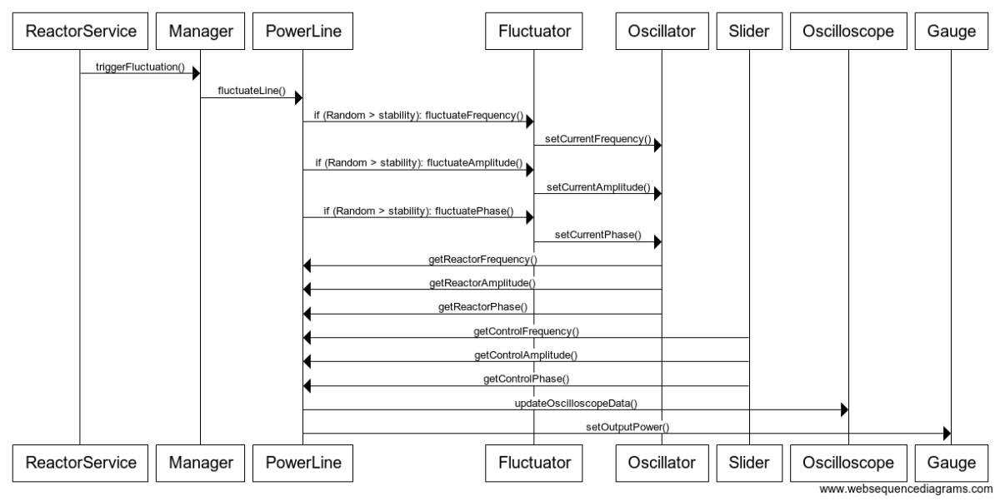

# Arkkitehtuurikuvaus

## Rakenne
Sovellus noudattaa kaksitasoista kerrosarkkitehtuuria ja sen pakkausrakenne on seuraava:

Pakkaus _ui_ sisältää JavaFX:llä toteutetun käyttöliittymän ja _domain_ sen taustalla toimivan sovelluslogiikan. Sovelluksen tietojen tallennuksesta ja tietoliikenteestä vastaavia osia ei ole vielä toteutettu, mutta ne tulevat muodostamaan oman pakkauksensa.

## Käyttöliittymä
Sovelluksen käyttöliittymä koostuu yhdestä näkymästä jonka on tarkoitus tarjota immersiivinen kokemus loogisesti toimivasta ja tiettyjä lainalaisuuksia noudattavasta virranhallintajärjestelmästä joka yhdistää kuvitteellisen avaruusaluksen reaktorin sen muihin järjestelmiin. Tämän vuoksi käyttöliittymä ei sisällä mitään metatason elementtejä, vaan koostuu ainoastaan järjestelmän toimintaa ohjailevista hallintalaitteista ja sen tilasta kertovista instrumenteista. 

Käyttöliittymä on pyritty eristämään täysin sen toimintaa ohjailevasta sovelluslogiikasta siten, että se ainoastaan esittää käyttäjälle sovelluslogiikan tuottamat tulokset ja välittää sovelluslogiikalle käyttäjän toimet metodikutsujen välityksellä. Tämänhetkisessä muodossaan käyttöliittymä näyttää seuraavalta:

## Sovelluslogiikka
Sovelluksen loogisen mallin muodostavat luokat _Manager_, _PowerLine_, _Oscillator_, _Fluctuator_, _PowerChannel_ ja _Breaker_ (joihin tullaan vielä lisäämään luokka _MainOutput_). Nämä luokat muodostavat seuraavan kaltaisen hierarkkisen rakenteen, jossa vaakasuora akseli kuvaa niiden välistä hierarkiaa ja pystysuoran akselin voidaan nähdä kuvaavan sovelluksen sisäistä virrankulkua:

## Luokkakaavio

## Sekvenssikaavio
### Reaktorilinjan satunnaisvaihtelun laukeaminen

