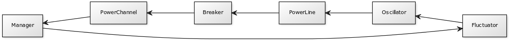

# Arkkitehtuurikuvaus

## Rakenne
Sovellus noudattaa kaksitasoista kerrosarkkitehtuuria ja sen pakkausrakenne on seuraava:

Pakkaus _ui_ sisältää JavaFX:llä toteutetun käyttöliittymän, _domain_ sen taustalla toimivan sovelluslogiikan, ja _dao_ ulkomaailman kanssa kommunikointiin tarvittavan toiminnallisuuden (joka tässä vaiheessa tarkoittaa lokitietojen automaattista keräämistä ja tallentamista tiedostoon. Verkkotietoliikenteestä vastaavia osia ei valitettavasti ollut mahdollista mahduttaa vielä tämän projektin aikatauluun, mutta ne tulevat sisältymään _dao_-pakkaukseen, kuten myös lokitietojen tietokantatallennuksesta huolehtivat luokat.

## Käyttöliittymä
Sovelluksen käyttöliittymä koostuu yhdestä näkymästä jonka on tarkoitus tarjota immersiivinen kokemus loogisesti toimivasta ja tiettyjä lainalaisuuksia noudattavasta virranhallintajärjestelmästä joka yhdistää kuvitteellisen avaruusaluksen reaktorin sen muihin järjestelmiin. Tämän vuoksi käyttöliittymä ei sisällä mitään metatason elementtejä, vaan koostuu ainoastaan järjestelmän toimintaa ohjailevista hallintalaitteista ja sen tilasta kertovista instrumenteista. 

Käyttöliittymä on pyritty eristämään täysin sen toimintaa ohjailevasta sovelluslogiikasta siten, että se ainoastaan esittää käyttäjälle sovelluslogiikan tuottamat tulokset ja välittää sovelluslogiikalle käyttäjän toimet metodikutsujen välityksellä. Sovelluksen version 1.0 käyttöliittymä näyttää seuraavalta (käyttöliittymän osat on selitetty tarkemmin Käyttöohjeessa:

## Sovelluslogiikka
Sovelluksen loogisen mallin muodostavat luokat _Manager_, _PowerLine_, _Oscillator_, _Fluctuator_, _PowerChannel_ ja _Breaker_. Nämä luokat muodostavat seuraavan kaltaisen hierarkkisen rakenteen, jossa _PowerLine_- ja _PowerChannel_-luokat liittyvät _Manager_-luokkaan joka ohjaa niiden molempien toimntaa. _Oscillator_-luokaon oliot liittyvät aina yhteen _PowerLine_-luokan olioon, ja _Oscillator_-olioon voi puolestaan liittyä _Fluctuator_-olio, joka säätelee sen toimintaa. _Breaker_-luokan oliot puolestaan muodostavat osan _PowerChannel_-olioista tai "kuuluvat niihin".

Toisaalta sovelluslogiikasta huolehtivat luokat voidaan nähdä myös toiminnallisessa suhteessa toisiinsa alla olevan kuvan tavoin. Tieto – jonka tässä tapauksessa voidaan nähdä edustavan abstraktisti energiavirtaa, kulkee _Fluctuator_-olioiden säätelemänä _Oscillator_-olioista _PowerLine_-olioon jonka muokkaamana se kulkee _Breaker_-olion läpi _PowerChannel_-olioon ja sen kautta edelleen _Manager_-oliossa sijaitsevaan päätepisteeseensä tässä sovelluksessa. Samalla kuitenkin _Manager_-olion sisältämät ajastimet hallitsevat tätä koko kejua nimenomaan säätelemällä _Fluctuator_-olioiden toimintaa, jolloin toiminnallisen tiedonkulun kannalta sovelluksen looginen rakenne voidaan nähdä jonkinlaisena kehänä ja kyberneettisenä takaisinkytkentäpiirinä.

## Luokkakaavio
Alla oleva luokkakaavio esittää sovelluksen luokat tietorakenteen ja riippuvuuksien näkökulmasta. Luokkakaavioon on sisällytetty myös luokkien toteuttamat metodit, lukuunottamatta gettereitä ja triviaaleja settereitä, jotka eivät juurikaan liity luokkien väliseen vuorovaikutukseen:

## Sekvenssikaavio
Alla esitetyt sekvenssikaaviot kuvaavat ohjelman pääasiallista toimintaa, joka koostuu virtalinjoja syöttävien oskillaattoreiden parametreissa tapahtuvasta satunnaisvaihtelusta, sen muussa järjestelmässä aikaan saamista ketju- ja takaisinkytkentäreaktioista, ja käyttäjän reagoinnista näihin. Ensimmäinen kaavio kuvaa reaktorilinjassa tapahtuvan satunnaisvaihtelun laukeamista PowerLine-Linjasta lähtien, ja toinen kaavio esittää saman tapahtumaketjun etenemistä "ylöspäin" ketjussa eli PowerChannel-luokan olioiden kautta kohti Manager-olion hallinnoimaa pääulostuloa, joka tulee muodostamaan sovelluksen ulkoisen rajapinnan Empty Epsilon -sovelluksen suuntaan.

### Reaktorilinjan satunnaisvaihtelun laukeaminen 1

### Reaktorilinjan satunnaisvaihtelun laukeaminen 2

## Sovelluksen rakenteeseen jääneitä heikkouksia

Kenties selvimmät heikkodet sovelluksen rakenteessa liittyvät sen kahteen suurimpaan luokkaan: noin puolta sovelluksen toimintalogiikasta vastaavaan _PowerLine_-luokkaan ja koko käyttöliittymän rakentavaan _InitUI_-luokkaan. Näistä molemmat olisi järkevää jakaa useampaan osaan, mutta valitettavasti näin suurelle refaktorointioperaatiolle ei jäänyt tämän projektin puitteissa aikaa. _PowerLine_-luokka olisi luontevinta jakaa kahteen osaan, joista toinen huolehtisi reaktorilinjasta ja sen säätämiseen käytettävistä kontrolleista, ja toinen puolestaan tarkkailuinstrumenttien, eli oskilloskoopin ja voimalinjan ulostulovirtamittarin logiikasta. 

Käyttöliittymän rakentaminen puolestaan kannattaisi ehkä jakaa jopa kolmeen tai neljään osaan niin, että yksi luokka vastaisi yllä kuvatun uuden _PowerLine_-luokan käyttöliittymästä, toinen oskillaattorin ja virtamittarin visualisoinnista, kolmas _PowerChannel_-luokan edustaman tasapainotus ja -lämmönhallintaosan käyttliittymästä ja viimeinen pääulostulon käyttöliittymästä. Näin ei käyttöliittymäkomponentit luovien metodien löytäminen olisi helpompaa kuin tämänhetkisestä suuresta luokasta.

Toinen, enemmänkin määrällinen, puute sovelluksessa on tietoliikennekomponentin poisjäänti; vaikka sen toteuttaminen ei koodimäärällisesti olisi kovinkaan suuri urakka, sen vaatiman testausympäristön rakentaminen ei lopulta ollut mahdollista tämän projektin aikataulun puitteissa.
