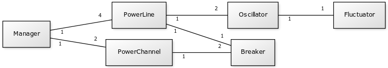

# Arkkitehtuurikuvaus

## Rakenne
Sovellus noudattaa kaksitasoista kerrosarkkitehtuuria ja sen pakkausrakenne on seuraava:

Pakkaus _ui_ sisältää JavaFX:llä toteutetun käyttöliittymän, _domain_ sen taustalla toimivan sovelluslogiikan, ja _dao_ ulkomaailman kanssa kommunikointiin tarvittavan toiminnallisuuden (joka tässä vaiheessa tarkoittaa lokitietojen automaattista keräämistä ja tallentamista tiedostoon. Verkkotietoliikenteestä vastaavia osia ei valitettavasti ollut mahdollista mahduttaa vielä tämän projektin aikatauluun, mutta ne tulevat sisältymään _dao_-pakkaukseen, kuten myös lokitietojen tietokantatallennuksesta huolehtivat luokat.

## Käyttöliittymä
Sovelluksen käyttöliittymä koostuu yhdestä näkymästä jonka on tarkoitus tarjota immersiivinen kokemus loogisesti toimivasta ja tiettyjä lainalaisuuksia noudattavasta virranhallintajärjestelmästä joka yhdistää kuvitteellisen avaruusaluksen reaktorin sen muihin järjestelmiin. Tämän vuoksi käyttöliittymä ei sisällä mitään metatason elementtejä, vaan koostuu ainoastaan järjestelmän toimintaa ohjailevista hallintalaitteista ja sen tilasta kertovista instrumenteista. 

Käyttöliittymä on pyritty eristämään täysin sen toimintaa ohjailevasta sovelluslogiikasta siten, että se ainoastaan esittää käyttäjälle sovelluslogiikan tuottamat tulokset ja välittää sovelluslogiikalle käyttäjän toimet metodikutsujen välityksellä. Sovelluksen version 1.0 käyttöliittymä näyttää seuraavalta (käyttöliittymän osat on selitetty tarkemmin Käyttöohjeessa:

## Sovelluslogiikka
Sovelluksen loogisen mallin muodostavat luokat _Manager_, _PowerLine_, _Oscillator_, _Fluctuator_, _PowerChannel_ ja _Breaker_. Nämä luokat muodostavat seuraavan kaltaisen hierarkkisen rakenteen. 

## Luokkakaavio

## Sekvenssikaavio
### Reaktorilinjan satunnaisvaihtelun laukeaminen

