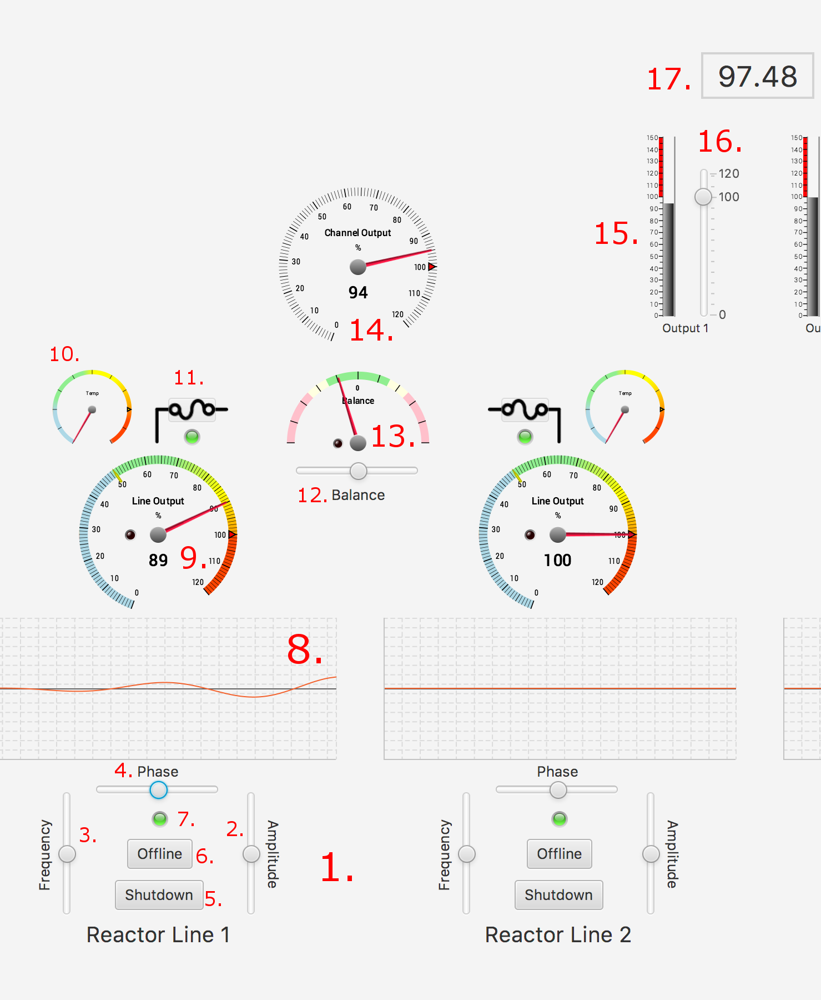

# Power Management - User Manual
This document will provide a short introduction to the user interface of the Power Management application, its purpose 
and some tips for using it.
## UI Components
Since the application is intended to be used as a part of the diegetic environment of a Live-Action Roleplahying game (LARP), 
the user interface of the application has been designed to contain only diegetic or "in-game" elements, with no meta-level 
controls. The components of the user interface have been numbered in red in the following diagram, and are explained individually 
below:

### Components
1. Reactor line controls: This section of the user interface contains the primary controls that are used, together with the 
Oscilloscope view, to optimise the pwoer throughput of the system. 
2. Amplitude control: This slider controls the amplitude of the control oscillator and is used to match the magnitude of the input and 
control waveforms to each other.
3. Frequency control: This slider controls the frequency of the control oscillator and is used to match the wavelength of the control 
waveform to the input waveform so that the resulting waveform stays uniform along the horizontal axis.
4. Phase control: This slider controls the phase of the control oscillator and is used to align the control waveform to the input waveform 
so that their peaks and valleys are aligned and cancel each other out.
5. Shutdown button: This button starts the shutdown sequence, which lasts for 10 seconds, during which the indicator light will flash 
yellow and the output of the line will be 0%. After the shutdown sequence is complete, the waveform normalizes and the text on the button 
changes to "Startup" and the line can be restarted, during which the light will again flash.
6. Offline button: This button will switch the line to offline mode, which means that its output will be 0% and it will not be influenced 
by fluctuations, allowing it to be adjusted back to normal without interference. The line can be switched back online by pressing the button 
again. While the line is offline, the indicator light will light yellow.
7. Indicator light: This light will be green when the line is in normal operation, yellow when it is offline, flashing yellow when it is 
being shut down or started up, flashing red when the line is unstable dues to distorted waveform, and dark, when the line is shut down.
8. Oscilloscope: This display will show the waveform as a horzontal line when the input and control waveforms are perfectly aligned , in 
which case the line output will be 100% of the input. Both line output, heat accumulation and the amount of fluctuation are affected by 
the amount of fluctuation in the waveform.
9. Line output gauge: This gauge shows the current power output or efficiency of the power line, from 0 to 120% (possible when the 
reactor input is overdriven).
10. Temperature gauge: This gauge indicates the heat accumulated into the breaker; when the gauge reaches its end, the breaker will be 
tripped, and it can only be reset when the temperature has cooled to 80% or lower. 
11. Breaker: The circuit breaker will cut the power from the line to the channel input when the temperature gauge reaches its end. The signal 
light will show yellow in the danger zone, and blink red when the breaker is tripped and waiting to cool down. As it is sufficiently cooled down, 
the light will go off and the button will activate, allowing the breaker to be reset. Resetting the breaker takes 60 seconds, so tripping it should 
be avoided at all costs.
12. Balance control: This slider controls the propertion in which the left and right input of the channel are directed to the output. It can be used 
to keep the channel in balance when one of the lines needs to be taken offline, or when one is giving out significantly less power and the situation 
cannot be immediately remedied.
13. Balance gauge: This gauge indicates the balance of the channel output. If the balance tilts to the yellow or red area, it will cause both 
increased heating and incrased fluctuation in the breakers and power lines.
14. Channel output gauge: This gauge indicates the amount of power being output from the channel to the main output and is dependent on the power being input 
to the two inputs of the channel and the setting of he balance control.
15. Output gauge: These two gauges indicate both the balance and amount of power being fed to the main output, and should be kept as close to each other as possible 
to avoid overheating and fluctuation.
16. Output gain control: These controls can be used to adjust the power output to the needs of the ship. They allow a small degree of overdriving, but at the cost of 
increased heat and instability. On the other hand, they can be used to cut down powr output, which will significantly reduce the heat output 
and increase stability, allowing the system to be left unattended for long periods of time.
17. Main output: This dial shows the total percentage of the nominal maximum power being fed to the ship's systems and available for its different functions.

## Purpose of the application 

The Power Management application can be considered a game, but as a traditional game it is, quite frankly, not very interesting, 
and it does not since it for example does not have a victory condition or any kind of scoring. In this sense it is more of a simulator, 
that is intended to be played as a part of a larger whole. Not just as a part of a spaceship simulation game in Empty Epsilon, 
but as a part of an immersive live-action roleplaying game, where playing the game, or taking care of the power management of a 
spaceship is just one of the many duties belonging to certain characters, who in this case are vrew members of a spaceship. For this 
reason the pace of the game, especially with conservative power settings, is extremely slow, and it can in most cases be left alone 
without dramatic effects for at least half an hour, perhaps even longer. This is intentional, since LARPs usually last for anything 
from 8 to 48 hours, and it would not be very practical or enjoyable to force someone to constantly monitor and adjust the system every 
ten seconds. In order to find a balance between peaceful routine and adrenaline-filled moments, the timers in the game are quite steeply 
progressive in relation to the total power draw and the reactor output. Once the system is overdriven, it will require very close 
monitoring and at extreme settings, i.e. in combat or pursuit situations, it will demand tight focus and nimble hands.

In its simplicity, the objective of the game is to keep the power management system of the ship from overheating or becoming too 
unstable, while still delivering the needed amount of power to the ship's systems, whether it be a leisurely 60% of full power in idle 
moments or the absolute maximum available in life-or-death combat situations. The primary means to achieve this is to adjust the 
adjustment oscillators of the power lines using the oscilloscopes in order to keep the waveform as flat as possible, and when that 
fails, to take an individual line that has become too unstable temporarily offline so that it can be reset, and compensating for this 
using the various balance controls.

